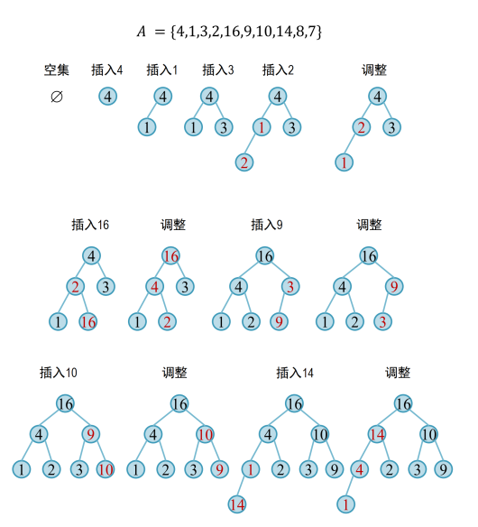
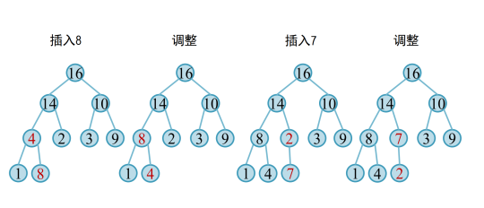
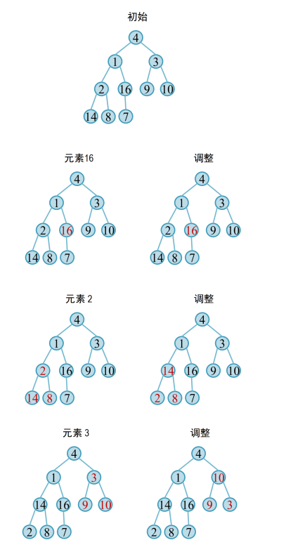
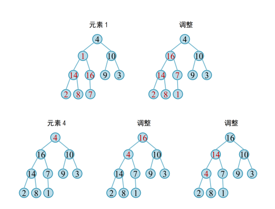
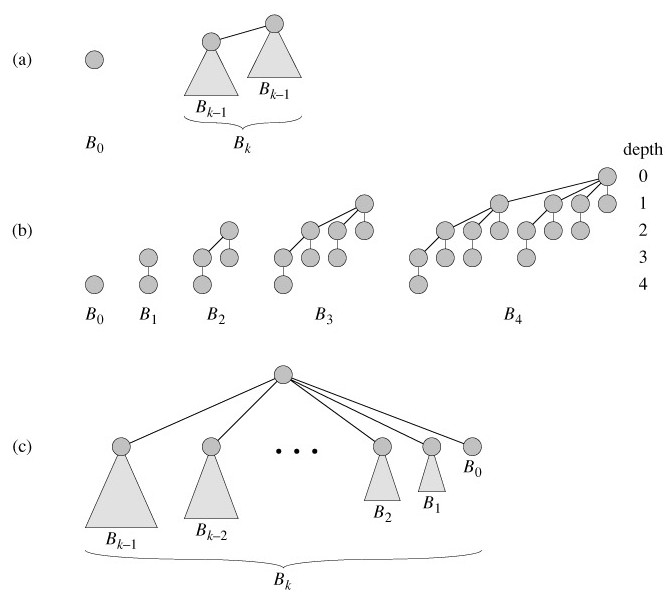

# 堆（heap）

​	从定义上来看，堆是一种满足特定性质的完全二叉树。在本章中，我们将侧重这些特殊性质，对堆这一数据结构进行简要描述，并进行一些简单的扩展。

#### 基本堆操作

​	对于二叉堆来说，其基本操作与二叉树类似，包括但不限于：创建、销毁空堆，向堆中插入、删除与修改元素，判断堆是否为空(此处可以参考ADT）。这里我们将只从其所具有的的特殊性质来讨论堆与二叉树的差异性方法。

1. **堆调整算法**

   ​	对于如何修复一个有**一处**结构受损的堆，较为普遍的操作有**自顶向下调整**与**自底向上的调整算法**。这两种修复方法都是O（n）的。这两算法要求对于大堆，根节点的左右孩子都是大堆。

   1. **自顶向下调整**

      如果某个结点的关键字小于其某个子结点的关键值，可以采用自顶向下调整(Heapify-down)的算法进行修复。具体操作是：

      ```
      1. 计算当前节点的两个子节点的较大值
      2. 如果满足堆性质则终止，否则与其父亲节点交换，取交换后的节点为当前节点并重新进行第一步。
      3. 重复上述过程直到每个节点都满足最大堆的性质。
      ```

   2. **自底向上调整**

      ​	总体来看操作与上面是相似的：

      	1. 计算当前节点的父节点的值
      	2. 如果满足堆性质则终止，否则交换，取交换后的节点为当前节点并重新进行第一步
      	3. 重复上述过程直到每个节点都满足最大堆的性质


   总的来说，从上面两个过程可以看出即使在最坏的情况下，对一处结构的修改至多有O(H)的复杂度，H为堆的高度

2. **堆构造方法**

   对于构造堆，我们可以有两个思路：

   ​		其一是从空堆开始建立，将元素逐个插入堆中，然后调用自底向上的调整方法。这也被称为**自顶向下的构造**。这一算法的时间复杂度是小于$O(nlogn)$的。（n为节点数）

   ​		另一种思路是假定对应数组/指针数组等已经内蕴了一棵完全二叉树此时，长度为𝑛的二叉树𝐴中， $𝐴[\lfloor \frac{𝑛}{2}\rfloor, … , n-1]是\lfloor\frac{n}{2}\rfloor$个堆  ，然后从 $\lfloor \frac{n}{2}\rfloor-1$到0反向遍历数组(即二叉树的非叶子结点)， 采用自顶向下堆化操作  ，这也被称为**自底向上的构建**。这一方法的时间复杂度是O(n)的。

   ​	当然对于这两种堆构建方法得到的堆也不尽相同。

   ​	下面是两种方法的一个具体展示，图片来自冯伟老师的PPT：

   **自顶向下的构造：**
   
   ​             
   
   
   
   **自底向上的构造：**
   
   
   
   
   
   ​	上面的内容与数算课堂上讲到的并无二致，这里知识做一总结与归纳。下面我们对堆进行一些性质上的要求，这边有了下面提到的二项式堆，左式堆等更特殊的形式。
   
   ​	


#### 二项式堆

​	二项式堆（Binomial Heap）是对完全二叉堆的一个拓展。其可以更快地合并两个堆。

> 对于二叉堆的合并，最容易想到的方法是把两个二叉堆首尾相连放在一个数组中，然后构造新的二叉堆。时间复杂度为$O(logn logk)$，其中n、k为两个堆的元素数目，这里就不赘述。

##### 二项树

​	二项树$Bk$ 是一种递归定义的有序树。二项树 $B_0$只包含一个结点。二项树$B_k$由两个子树$B_{k-1}$ 连接而成：其中一棵树的根是另一棵树的根的最左孩子。如下图所示。（下面图片均来自cnblogs.com）。



二项树的性质有：

> 1. 共有 2k 个节点。
> 2. 树的高度为 k。
> 3. 在深度 d 处恰有  个结点。
> 4. 根的度数为 k，它大于任何其他节点的度数；如果根的子女从左到右的编号设为 k-1, k-2, …, 0，子女 i 是子树 $B_i$ 的根。
> 5. 在一棵包含 n 个节点的二项树中，任意节点的最大度数为$logN$

##### 二项堆

​	二项式堆是一组二项式树，其中每个二项式树都遵循最小堆属性。 对于任意非负整数 k，在 H 中至多有一棵二项树的根具有度数 k。

​	具有 n 个节点的二项式堆的二叉树数等于 n 的二进制表示中的设置位数。 例如，设 n 为 13，在 n (00001101) 的二进制表示中有 3 个设置位，因此有 3 个二叉树。 我们还可以将这些二叉树的程度与设置位的位置联系起来。 通过这种关系，我们可以得出结论，在具有“n”个节点的二项式堆中存在 O(Logn) 棵二项树。

​	我们下面介绍其最具特色的堆合并操作:

**Binomial Heap的union()操作**：

​		给定两个二项式堆 H1 和 H2，union(H1, H2) 创建一个二项式堆


​		第一步是以非递减的度数顺序简单地合并两个堆。上图中，图（b）显示了合并后的结果。简单合并后，我们需要确保对于任意非负整数 k，在 H 中至多有一棵二项树的根具有度数 k。为此，我们需要组合相同阶数的二项树。

​	我们遍历合并根的列表，我们跟踪三指针 prev-x、x 和 next-x。当我们遍历根列表时，可能有以下4种情况。

>1. x和next-x的顺序不一样，我们直接往前走。在以下3种情况下，x和next-x的阶数是相同的。
> 2. 如果next-next-x的阶数也一样，继续往前走。
>3. 如果x的key小于或等于next-x的key，则通过将next-x与x链接使next-x成为x的子节点。
>4. 如果x的key更大，则让x成为next的孩子。

这一操作最坏情况下时间复杂度是$O(logn)$。

有了上面的合并操作，其他操作就比较简单了。例如插入就可以看做是一个节点为1的二项树与原二项堆合并。

最后再提一提二项式堆的删除操作，其主要思路是：

>1、找到删除键值所在的节点，将待删键值上提到所在二项树的根。
>
>2、将该二项树根的孩子组成一个新的堆。即将孩子的度从原本的大到小连接变为小到大连接；并取消孩子的父节点置空。
>
>3、将待删键值所在的树根从二项堆中删除。
>
>4、将二项堆和孩子组成的新堆合并。


#### 左式堆（Leftist Heap）

​	左派树是具有以下属性的二叉树：

1. **普通最小堆属性：** key(i) >= key(parent(i))

2. **左侧较重**：任意结点的左孩子的Npl大于等于右孩子的Npl(null path length，指从该结点到达一个没有两个孩子的结点的最短距离（一个孩子的结点或者叶子））。一般定义NULL的Npl为-1以使计算简便。容易得到，任意结点的Npl是它的孩子的Npl中较小的那个结点的Npl+1。（下面图来自greeksforgeeks官网）

   

> 1. 从根到最右边的叶子的路径是从根到叶子的最短路径。
> 2. 如果到最右边叶子的路径有 x 个节点，那么左堆至少有 2 x – 1 个节点。这意味着对于具有 n 个节点的左堆，到最右边叶子的路径长度是 O(log n)。

我们这里只考察合并(merge)操作：

​	由于右子树较小，因此想法是将一棵树的右子树与另一棵树合并。具体操作如下：比较两个堆的根。将较小的键推入一个空堆栈，然后移动到较小键的右孩子。递归比较两个键并继续将较小的键压入堆栈并移动到其右孩子。重复直到到达一个空节点。取最后一个处理的节点，使其成为栈顶节点的右孩子，如果违反了左堆的属性，则将其转换为左堆。递归地继续从堆栈中弹出元素并使它们成为新堆栈顶部的右孩子。


节点 7 的子树违反了左堆的属性，所以我们将它与左孩子交换并保留左堆的属性。


对于栈中元素重复上述过程，得到下面的结果。


​	

​	当然，这些堆的特殊性质不止如此，如果你想更多地了解，那就去探索吧！