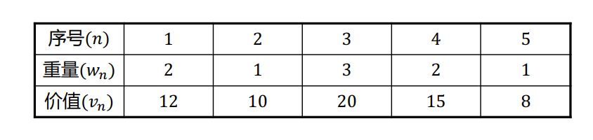
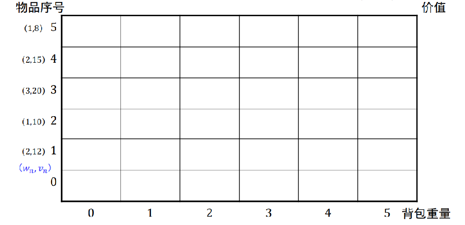

# 10.1   递归（recursion）

## 10.1.1  递归的概念

递归并非本教程的重点。在我们讨论的范畴中，递归指一个算法设计成某一个过程调用自己的形式。一般来讲，一旦算法学习者通过基础的训练掌握了递归的思想，将会发现递归算法在各种问题中的应用非常巧妙而自然，它很可能会成为您解决问题时比较容易想到的几种方法之一。

在理论上，递归过程具有特殊的性质和地位，有很多相关的非常有趣而深刻的研究问题（比如停机问题、分形等）。递归的思想在计算科学和与之相关的数学、逻辑学中非常重要，值得进一步拓展研究。

## 10.1.2  递归的消除

尽管递归思想巧妙而自然，递归算法的直接实现（使用递归函数）往往会带来较差的性能（为什么？）。因此，我们经常希望将想到的递归算法转化为不用递归函数实现的形式。这就是递归的消除。

### 尾递归

当递归调用仅仅发生在函数的最后时，完全可以用循环代替递归！例如求阶乘的递归程序：

```c
int fac(int x)
{
    if(x == 0) return 1;
    else return x * fac(x-1);
}
```

完全可以写成：

```c
int fac_(int x)
{
    int temp = 1;
    for(; x > 0; x--)
    {
        temp *= x;
    }
    return temp;
}
```

### 单向递归

递归调用（可以不止一处）都在末尾，而且各递归调用语句的参数之间没有关系时，称为单向递归（为什么这样叫？），可以化为循环（递推）。尾递归显然是单向递归的一个特例。例如菲波那切数列的递归算法：

```c
int fib(int x)
{
    if(x < 2) return x;
    else return fib(x-1) + fib(x-2);
}
```

等效于递推算法：

```c
int fib_(int x)
{
    if(x < 2) return x;
    int temp1 = 1, temp2 = 0, cur;
    for(int i = 2; i <= x; i++)
    {
        cur = temp2 + temp1;
        temp2 = temp1;
        temp1 = cur;
    }
    return cur;
}
```

应当注意，不止一次递归调用时，消除递归的好处往往不止是节约了大量的函数调用耗时和便于管理栈上的空间，而且能够大大减小计算复杂度（可以分析一下）。

### 使用栈消除递归

更多的情况是，递归不能化为简单的循环。这时候，为了避免大量函数调用和栈上空间占用，可以使用手动构造的栈来实现函数内的等效递归。

# 10.2   动态规划（Dynamic Programming）

## 10.2.1  动态规划的概念

首先我们应该明确，动态规划是一种**算法思想（而非一种确定的方法）**，可以用动态规划解决的问题形式极度灵活，具体的算法流程也没有太明显的套路。这些特点使得动态规划类问题成为算法设计领域最有挑战性也最为有趣的问题类型之一。因此，本篇教程重在借助一些简单的例子阐释清楚其根本思想。

这里先给出这种思想的文字表述：动态规划是一种改进暴力遍历算法的思想，它通过**巧妙的计算流程设计**，**实现空间换时间（存储一些中间结果）**，最终**减少无效的遍历和重复计算**。具体来讲，是**将整个大问题的暴力遍历解法改为一系列小问题的依次求解**，这些**小问题的规模逐渐变大**，**且每个较大问题的解都可以由之前解决过的小问题的解经过简单计算得到**；最终问题增大为整个问题之后，自然就得到了整个问题的解。

## 10.2.2  通过示例理解动态规划思想

### 背包问题（Knapsack Problem）

问题的设定如下：给定N个重量为$w_1$,$w_2$,...,$w_N$，价值为$v_1$,$v_2$,...,$v_N$的物品和一个承重量为W的背包，选择一些物品放到背包中，求使得背包中物品价值最大的方案。

举个具体的例子：取N=W=5，其他参数见下图。

<div align="center">    

</div>

这是一个离散空间的条件极值问题。我们首先能想到遍历法：把所有可能的组合遍历一遍，找到满足约束的总价值最大的组合。但是显然这样产生的指数级复杂度太高了。另一种比较容易想到的思路就是递归：即我们可以依次讨论是否携带第n个物品，将问题化为更小规模的问题，形成递归。简单考虑一下递归关系应当是（在携带这个物品和不携带这个物品的解中取更优者）（这里$OPT(n,w)$表示在只考虑前n个物品、背包还剩下重量w时的最大价值）：
$$
OPT(n,w)={\rm max}\{OPT(n-1,w),OPT(n-1,w-w_n)+v_n\}
$$
再给出一些非常小容积的解决方案（递归的跳出条件）即可。然而简单分析容易发现，仍然是指数级的复杂度，计算量与直接遍历没有本质区别。但是，递归思路帮助我们将遍历过程按照一种清晰的逻辑进行了重新安排，让我们容易通过递归树（见下图；左列数字表示n值，树中数字表示w值；黄色背景代表重复的计算）看出低层次存在大量重复计算。

<div align="center">    

</div>

为了避免这种情况发生，我们自然想到可以将低层次的计算结果存储起来。基于此，可以设计如下的“动态规划算法”：**从低层次开始向上计算**（注意递归算法是从高层次向下计算！），并将每一步的计算结果都存下来。较高层次的结果由较低层次的结果**按照与递归算法一样的递推式给出**。这样整个求解过程等效于依次计算并完成如下图所示的表格：

<div align="center">    

</div>

至此，我们已经自然地给出了一种运用动态规划思想的算法。读者可以将这个例子与10.2.1中的思想对比，以深入理解该思路。为了更好地理解算法的细节，最好的方法就是动手实现一下：可以浏览并运行`baggage.cpp`文件来作参考并检验您的实现。

### ”完全背包（Complete Knapsack Problem）”问题

这个问题的设定与上面的背包问题几乎一模一样，只不过把每个物品只能拿一次改为每个物体可以拿无限次。

显然，其解决思路与背包问题也几乎一样，只需要在写递推公式的时候做一个小小的修改（当你选择这一次要使用n号物品时，你应当继续考察还考虑这个物品但背包容积缩小的问题！）（您可以对照前面的公式以发现区别）：
$$
OPT(n,w)={\rm max}\{OPT(n-1,w),OPT(n,w-w_n)+v_n\}
$$

### 找零钱问题

给定N种不同面额$c_n$的硬币无穷个和一个总金额T，求可以凑成总金额的最少的硬币个数（如果没有任何一种硬币组合能满足，返回-1）。

初次看这个问题，你可能会觉得可以使用贪心算法，但是需要注意这里硬币的面额可能出乎你的意料。可以考虑这个例子来明白为什么贪心算法不能得到正确的解：总金额取20，三种硬币面额分别为1、5和6.正确答案为4枚（四枚面额为5的），然而贪心算法给出5枚（三枚面额为6的和两枚面额为1的）。

这个问题中，我们考虑凑成某个总金额t这个任务时，可以考察各个$t-c_n$的解决方案（届时应当是已经算好的）加上一枚硬币之后最少的硬币数，即是t的解决方案。具体地，写成递归式就是：
$$
OPT(t)=\max_n\{OPT(t-c_n)+1\}
$$
有了这个递归式，就可以依次计算t从0到T的解决方案，并不断记录计算结果供后面使用，最终T的解决方案即是整个问题的解。具体实现可以参考文件`change.cpp`。

### 求连续子串和的最大值

给定一个整数数组，求其中的具有最大和的连续子数组（不能为空）的和。例如，在数组[-2, 1, -3, 4, -1, 2, 1, -5, 4]中，连续子数组[4, -1, 2, 1]的和最大，为6.朴素算法需要至少n方的复杂度（挨个位置作开头，向后不断求和并记录最大值）。

应当指出，这种问题从不同的角度思考有可能给出不同的动态规划做法。这里给出一种比较直观的：我们依次求**以某一位为尾的连续子串中和最大的一个的和**。由于我们知道以前面一位为尾的最大和，因此现在这一位的要么是上一位的最大和加这一位的数，要么就是这一位本身。最终我们会得到以每一位为尾的最大和，取其中最大者即可。具体实现可以参考文件`max_sum.cpp`。

### 求最长的递增子串

求一个数组中最长的递增子数组（不一定连续）的长度。例如，在数组[10, 9, 2, 5, 3, 7, 23, 18]中，子数组[2, 3, 7, 23]为最长递增子数组，长度为4.朴素算法中最大的困难来源于可能跳位，需要考虑所有可能的选择，复杂度过高。

一种比较直观的方法是：考虑依次求**以某一位为结尾的递增子串中最长的一个的长度**。我们已经知道以前面各个位为尾的最长递增子串长度，而现在这一位的，一定是在前面某一个比它小的数的“最大长度”上加一，因此可以遍历前面比它小的数，找其中“最大长度”最长的一个加一即可。具体实现可以参考文件`max_len.cpp`。

### Floyd算法

求一个带权有向图的任意两点之间的最短距离。

这个算法是依次地计算在“只允许经一部分点中转”的情况下的解，并不断在这个“一部分”集合中增加点直至全部加入。

## 10.2.3  总结、抽象和拓展

还有很多种类的动态规划问题，不再一一举例。我们回顾一下，容易发现动态规划最根本的思想在于，将问题巧妙地转化为**一系列条件信息由简单到复杂的同类型问题**，然后从简单的开始依次地计算这些问题的解并**记录**下来，**较复杂的问题可以用较简单的问题的解非常容易地计算出来**。

很多题目的思路跟递归比较像，可以理解为避免了重复计算的递归算法（比如背包问题）。但是有的动态规划类解法从递归的角度出发去考虑并不是很自然（当然，也不是完全不行）（比如Floyd算法和上面两个与数字串有关的问题）。

在数学抽象中，这种转化之后的一系列的问题的解被称作一系列**状态**，较复杂的问题的解对于前面的问题的解的简单依赖关系称作**状态转移规律（方程）**。由于这些问题往往都是求极值类问题，因此为了实现后面问题的解简单依赖于前面问题的解，必须要求这种问题具有**无后效性**（后面问题解的求出不能依赖于前面问题最优解的达到方式）和**最优子结构（Optimal substructure）**（问题取得最优解时，对于其子部分的同类型问题必须也取最优解）。这些数学抽象是意义明确的，简单的，这里不再赘述。

实际解题的时候，最为困难的是其中构造这一系列问题（状态）的这一步。需要发现一个具备上述关键特征的问题，很多时候非常依赖灵感。但是也有一些特定的套路，比如先从递归的角度切入然后再转换；或者可以从状态转移关系入手：比如很多问题非常容易想到，可以对于每一个元素考虑其在解中是否出现，就可以顺着这个思路，从状态转移出发来找状态（背包问题最为明显）；还有一些其他的套路，可能需要额外的练习来掌握。

本教程没有涉及动态规划类算法的优化思路（比如状态压缩动态规划）等比较重要的知识；另外，动态规划与强化学习有着非常重要的联系。感兴趣的读者可以自行探索。